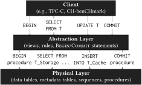
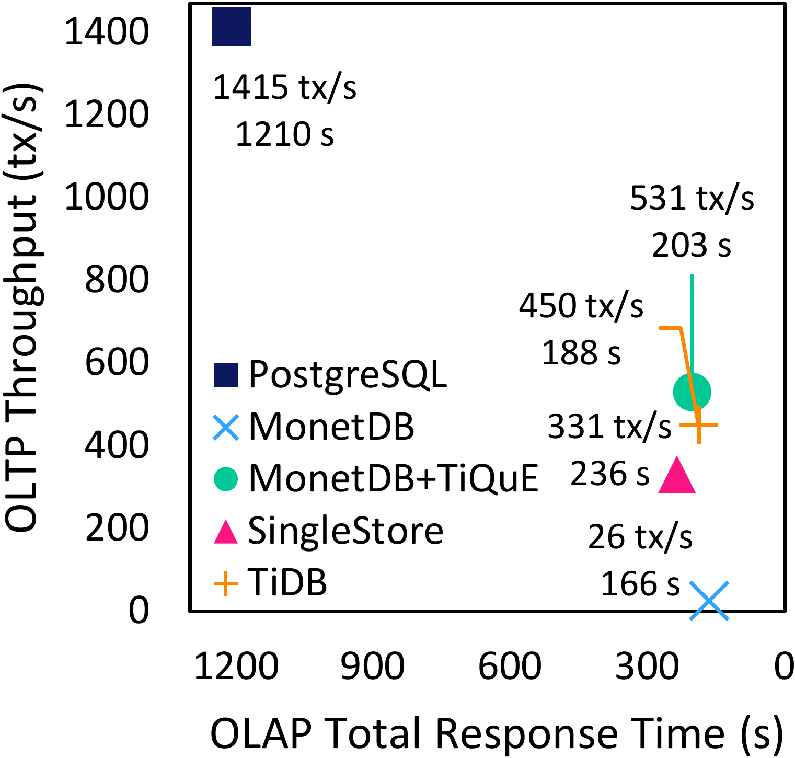

# TiQuE - Transactions in the Query Engine

This repo provides benchmarks and implementations of **T**ransactions **i**n the **Qu**ery **E**ngine, or TiQuE for short. The complete design can be found in the corresponding paper, *TiQuE: Improving the Transactional Performance of Analytical Systems for True Hybrid Workloads*, accepted for VLDB 2023. 

- [TiQuE - Transactions in the Query Engine](#tique---transactions-in-the-query-engine)
    - [Introduction](#introduction)
    - [Benchmarks](#benchmarks)
      - [Installation](#installation)
      - [Prepare the dataset](#prepare-the-dataset)
      - [Start the target database](#start-the-target-database)
      - [Run](#run)
    - [Correctness checker (Elle)](#correctness-checker-elle)
      - [Installation](#installation-1)
    - [Database setup](#database-setup)
      - [MonetDB](#monetdb)
      - [PostgreSQL](#postgresql)
      - [SingleStore](#singlestore)
      - [TiDB](#tidb)
    - [Results](#results)


### Introduction

TiQuE aims to push the transactional isolation to the query engine, by leveraging additional relations to represent metadata and using the query language (in this case, SQL) to compute the snapshot, process writes, and perform conflict computation. This allows building the isolation directly from the data definition, independently of the storage layer. Some advantages include adding efficient transactional support for systems that only support simpler guarantees - such as single atomic writes - supporting a wide gamut of isolation criteria, and providing transactional guarantees to polyglot systems (systems comprised of different database engines, possibly using different data models).

As shown in the following diagram, TiQuE's architecture considers three main layers:
- **Client** - the client applications that read and write to the database;
- **Abstraction Layer** - interface that receives clients' requests (based on the original schema) and translates them to the schema used by TiQuE. If possible, this layer is implemented directly in the database with views (translates reads) and rules/triggers (translates writes). If not, it can also be implemented in the database driver;
- **Physical Layer** - contains the application's data and metadata required by TiQuE.

<p align="center">
  
</p>

We use TiQuE for hybrid transactional-analytical workloads, by adding an efficient transactional isolation layer on top of [MonetDB](https://www.monetdb.org/), an OLAP-first database system. This allows us to substantially improve both transactional and hybrid performance, with little impact on analytical performance, making it competitive with HTAP systems. For example, the following chart plots the total response time of running all 22 CH-benCHmark queries against the TPC-C throughput with 32 clients (512 warehouses; more details in the paper and in the [results](/results) folder).

<p align="center">
  
</p>


### Benchmarks

(All tests were performed using Ubuntu 20.04 LTS)

#### Installation

```bash
sudo chmod +x bench/install.sh
./bench/install.sh
```

#### Prepare the dataset

```bash
cd bench

# Create dataset 
# (located at py-tpcc/pytpcc/tpcc_data_<warehouses>_<scale>)
# Replace <warehouse> with the number of warehouses
# Replace <scale> with the dataset scale:
#  scale=1 means the standard size;
#  scale=2 means half of the standard size; 
#  and so on.
# WARNING: as this relies on in-memory sqlite to generate the dataset,
# ensure that the system has enough memory (or memory + swap).
python3 gen_data.py <warehouses> <scale>

# Generate single key version (for tique and monetdbsinglekey)
python3 sql_tpcc_to_single_key.py py-tpcc/pytpcc/tpcc_data_<warehouses>_<scale>
```

#### Start the target database

Check the Section [Database setup](#database-setup).

#### Run

- OLTP (TPC-C, adapted from https://github.com/apavlo/py-tpcc/)
  ```bash
  sudo chmod +x ./run_oltp.sh
  # change the configs of run_oltp.sh if needed (e.g., database, warehouses, scale, clients, contention, ...)
  # the driver name can also be passed as argument (tique|monetdb|monetdbsinglekey|postgres|singlestore|tidb)
  ./run_oltp.sh [driver]
  ```

- OLAP (CH-benCHmark, adapted from https://db.in.tum.de/research/projects/CHbenCHmark/)
  ```bash
  sudo chmod +x ./run_olap.sh
  # change the configs of run_olap.sh if needed (e.g., database, warehouses, scale, clients, ...)
  # the driver name can also be passed as argument (tique|monetdb|monetdbsinglekey|postgres|singlestore|tidb)
  ./run_olap.sh [driver]
  ```

- HTAP (TPC-C + CH-benCHmark)
  ```bash
  sudo chmod +x ./run_hybrid.sh
  # change the configs of run_hybrid.sh if needed (e.g., database, warehouses, scale, clients, ...)
  # the driver name can also be passed as argument (tique|monetdb|monetdbsinglekey|postgres|singlestore|tidb)
  ./run_hybrid.sh [driver]
  ```

- Long-running transaction benchmark
  ```bash
  # the required arguments are the list of clients, the duration (in seconds), and the driver;
  # for TiQuE, set the -l flag to use the long-running transactions optimization.
  # (also for TiQuE, run over a clean database)
  python3 long_tx_bench.py -c <LIST_OF_CLIENTS> -t <TIME> [-l] <DRIVER>
  # E.g.:
  python3 long_tx_bench.py -c 1 2 4 8 16 32 -t 60 -l tique
  
  # for the list of available drivers and other options, use the -h flag.
  ```


### Correctness checker (Elle)

We also provide a consistency checker of TiQuE using [Elle](https://github.com/jepsen-io/elle), to demonstrate that it guarantees Snapshot Isolation.

#### Installation
- Install and start MonetDB;
- Install dependencies:
    ```bash
    sudo chmod +x ./checker/install.sh
    ./checker/install.sh
    ```
- Make sure there is a X11 server available and reachable and the `DISPLAY` variable is set. With headless Ubuntu, this can be done with the following commands:
    ```bash
    # install xvfb
    sudo apt-get -y install xvfb

    # start the virtual display in the background
    Xvfb :99 &

    # set the DISPLAY variable
    export DISPLAY=:99
    ```
- Update the database connection string in `executor.py` if necessary (for convenience, it uses database `tpcc` by default; **reset the server** if the database was previously used in a TPC-C run);
- Run:
    ```sh
    cd checker

    # generate input (example with 10000 transactions)
    lein run generator 10000 input.json

    # execute transactions (output will be saved to 'history.edn' by default)
    python3 executor.py input.json [outfile]

    # check consistency (anomalies will be present in the 'checker/out' folder)
    # should return {:valid? true} (use CTRL-C to exit since the program will still be running after the output)
    lein run checker history.edn

    # OR run everything in one go
    sudo chmod +x run.sh
    ./run.sh
    ```


### Database setup

(The optimizations performed can be found in [databases/optimizations.md](/databases/optimizations.md).)

#### MonetDB

- Install MonetDB (adapted from the Jan22 release):
    ```bash
    cd databases
    sudo chmod +x install_monetdb.sh
    ./install_monetdb.sh
    ```

- Run:
    ```bash
    sudo chmod +x run_monetdb.sh

    # edit the run_monetdb.sh file to change the number of maximum workers (default=32) 

    # to start with a new database named tpcc
    ./run_monetdb.sh clean &> /dev/null &

    # to use a previously created database named tpcc
    ./run_monetdb.sh &> /dev/null &
    ```

- Stop:
  ```bash
  sudo chmod +x stop_monetdb.sh
  ./stop_monetdb.sh
  ```

#### PostgreSQL

- Install PostgreSQL (14):
    ```bash
    sudo chmod +x databases/install_postgres.sh
    # edit the script if needed to change the default configurations (e.g., shared buffers)
    ./databases/install_postgres.sh # already creates a 'tpcc' database
    ```

- PostgreSQL automatically runs in the background using `systemd` with the `postgresql` service. To stop it, use `systemctl stop postgresql`.

#### SingleStore

- Install SingleStore (8.0):
  ```bash
  cd databases
  sudo chmod +x install_singlestore.sh
  
  # get a free license key from the SingleStore website
  # https://www.singlestore.com/self-managed-standard/

  # replace <LICENSE_KEY> with license key obtained from SingleStore
  ./install_singlestore.sh <LICENSE_KEY>
  ```

- Run:
  ```bash
  sudo chmod +x run_singlestore.sh
  ./run_singlestore.sh
  ```

- Stop:
  ```bash
  sudo chmod +x stop_singlestore.sh
  ./stop_singlestore.sh
  ```

#### TiDB

- Install TiDB (6.5.0):
  ```bash
  cd databases
  sudo chmod +x install_tidb.sh
  ./install_tidb.sh
  ```

- Run:
  ```bash
  sudo chmod +x run_tidb.sh
  ./run_tidb.sh
  ```

- Stop:
  ```bash
  sudo chmod +x stop_tidb.sh
  ./stop_tidb.sh
  ```


### Results
[Check the `results` folder.](/results)
