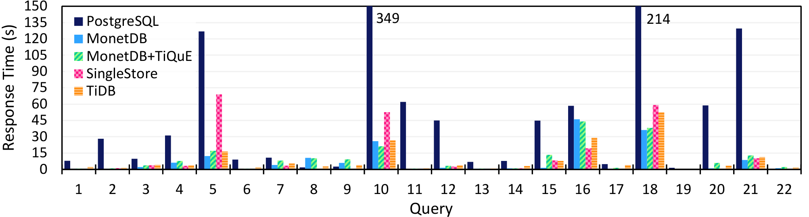

# Results

- **Benchmarks**: TPC-C (OLTP; contention), CH-benCHmark (OLAP), TPC-C + CH-benCHmark (hybrid), and a microbenchmark for the long-running tests; 
- **Dataset**: 512 TPC-C warehouses;
- **Instance**: Google Cloud VM, 32 vCPUs (N1 Series), 32 GB RAM (w/swap; the hybrid results use 128GB RAM), 500 GB SSD;
- **OS**: Ubuntu 20.04 LTS;
- **Versions**:
  - PostgreSQL: 14
  - MonetDB: fork of Jan22
  - SingleStore: 8.0.4
  - TiDB: 6.5.0

(More details available in the paper.)

### OLTP

|Throughput|Abort rate|
|-|-|
|||

### Contention

|Throughput|Abort rate|
|-|-|
|||

### OLAP
- 1 OLAP client (using all CPU cores).

### OLTP+OLAP (separately)
- 1 OLAP client (using all CPU cores) x 32 OLTP clients.

### Hybrid
- **OLAP on OLTP**: 6 OLTP clients x 0,1,...,6 OLAP clients (each OLAP client is limited to 4 CPU cores);
- **OLTP on OLAP**: 6 OLAP clients (each limited to 4 CPU cores) x 0,1,...,6 OLTP clients;
- **OLAP and OLTP**: 1,2,4,8,16 OLAP clients x 1,2,4,8,16 OLTP clients (each OLAP client is limited to 1 CPU core; Low: 1 OLAP and 1 OLTP; High: 16 OLAP and 16 OLTP).

|OLAP on OLTP|OLTP on OLAP|
|-|-|
|||

|OLAP and OLTP|
|-|
|

### Long-running
- Runs 1 long-running client (large r/w transaction) with N-1 short-running clients (N $\in$ {1, 2, 4, 8, 16, 32}).

|Throughput|Long-running response time|
|-|-|
|||
